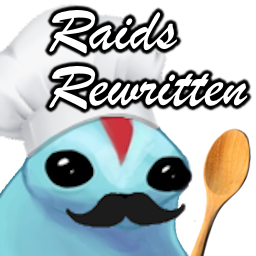

# RaidsRewritten

Plugin for [XIVLauncher/Dalamud](https://goatcorp.github.io/)

This plugin augments existing raids with custom mechanics just for fun.




### Available fights

- UCOB Rewritten
- ??? (in ~~time stasis~~ development)

## What's happening?

RaidsRewritten is (currently) entirely executed client-side. It hooks fight events to spawn fake attack VFX objects, then runs custom hit-detection checks to determine if the local player was hit by a fake attack. If so, this plugin overrides player controls to simulate the effects of a stun, knockback, etc. If multiple players are running the plugin, mechanic variations between all players are synced via using a fixed RNG seed.

⚠️ ***To be clear, RaidsRewritten does not change anything about the original fight, it only adds fake mechanics on top of it. Nothing sent to and from official Square Enix game servers are modified, and overridden player controls are only capable of performing what a player is normally able to perform (ex. a fake knockback is just forced movement in the knockback direction).*** ⚠️

#### Why is there a server folder then?

Please see [here]() for why.

## Support Discord

[](https://discord.gg/rSucAJ6A7u)

## Installation
- Enter `/xlsettings` in the chat window and go to the **Experimental** tab in the opened window.
- Scroll down to the **Custom Plugin Repositories** section.
- Paste in the following `repo.json` link into the first open text field
```
https://raw.githubusercontent.com/Ricimon/FFXIV-ProximityVoiceChat/refs/heads/master/repo.json
```
*All my plugins, including RaidsRewritten, are accessible from the ProximityVoiceChat repo json*
- Click the **+** button to the right of the text field and make sure the **Enabled checkmark** is checked.
- Click on the **Save Button** on the bottom-right of the window.

This adds plugins from this custom repo as installable plugins in the available plugins list. To then install the plugin itself,

- Enter `/xlplugins` in the chat window and go to the **All Plugins** tab in the opened window.
- Search for the **RaidsRewritten** plugin and click **install**.

## Contributing

Please use the support Discord for idea and code contribution discussion.

If you'd like to implement your own custom mechanic, use the existing mechanics as examples, and feel free to submit a pull request!

## Attributions

The XIV-interfacing parts of this plugin uses implementations taken from other open source projects. They are listed here and have my greatest appreciations for their work. Thank you to all the authors of these plugins for making this plugin possible.

- [Splatoon](https://github.com/PunishXIV/Splatoon), for fight event hooks
- [VFXEditor](https://github.com/0ceal0t/Dalamud-VFXEditor), for arbitrary VFX spawning
- [Brio](https://github.com/Etheirys/Brio), for arbitrary model spawning and game asset lookup
- [Penumbra](https://github.com/xivdev/Penumbra), for custom model replacements
- [Bossmod](https://github.com/awgil/ffxiv_bossmod), for player action overrides
- [vnavmesh](https://github.com/awgil/ffxiv_navmesh), for player movement overrides
- [ECommons](https://github.com/NightmareXIV/ECommons), for various XIV utility functions
- [SimpleTweaks](https://github.com/Caraxi/SimpleTweaksPlugin), for hotbar gray-out functionality
